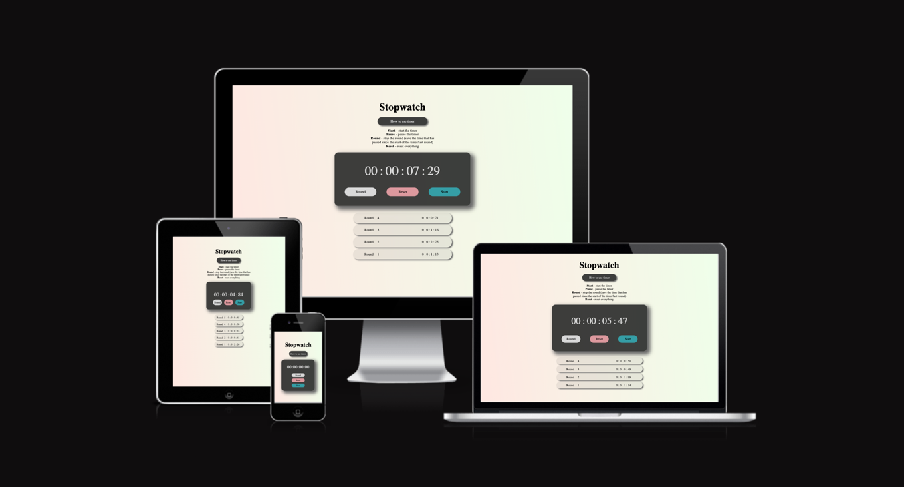
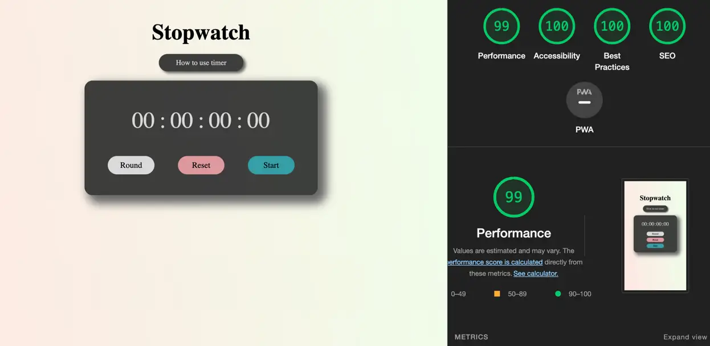
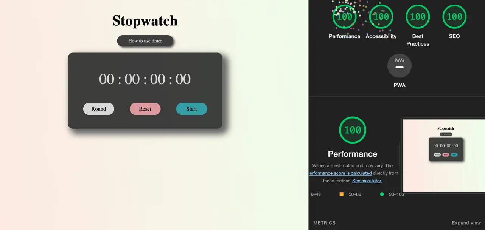
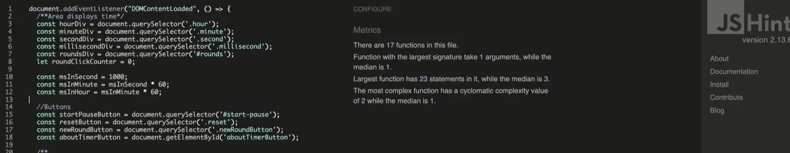

# **Stopwatch**
## **Overview**
The stopwatch can be used in a variety of ways in real life - in work, in studying, at home.

* <strong>Time Management</strong>: 

A stopwatch can help you manage your time better by tracking the amount of time you spend on different tasks. For example, you can use the stopwatch to time how long it takes you to complete a task, such as exercising, cleaning house or preparing a meal.

* <strong>Sports and Fitness</strong>: 

A stopwatch is commonly used in sports and fitness activities to measure the time it takes to complete an exercise or track your progress. For example, you can use the stopwatch to time your laps while running or swimming, or to time your rest intervals during sessions in the gym.

* <strong>Cooking and Baking</strong>: 

A stopwatch can also be useful in the kitchen when cooking or baking. You can use it to time how long you need to cook or bake a dish, or to keep track of the time for different cooking steps.

* <strong>Studying and Work</strong>: 

A stopwatch can be used to help you study or work more efficiently by tracking how long you spend on specific tasks or assignments. You can use it to time how long you study or work on a project, and then take breaks for a set amount of time to improve productivity and focus.

* <strong>Games and Competitions</strong>: 

A stopwatch can also be used in games and competitions, such as board games or track and field events . You can use it to time races, monitor how long each player takes to make their move, or to determine the winner in a tiebreaker situation.

Overall, a stopwatch can be a helpful tool in a variety of settings to measure time accurately and efficiently. The provided link offers a simple, user-friendly interface that can be used for all these purposes.

​

 
​
## Table of contents:
1. [**Site Overview**](#stopwatch)
1. [**Planning stage**](#planning-stage)
    * [***Target Audiences***](#target-audiences)
    * [***User Stories***](#user-stories)
    * [***Site Aims***](#site-aims)
    * [***Color Scheme***](#color-scheme)
    * [***Typography***](#typography)
1. [**Current Features**](#current-features-common-to-all-pages)
    * [***The rest of your features***](#features)
1. [**Testing Phase**](#testing-phase)
1. [**Deployment**](#deployment)
1. [**Tech**](#tech)
1. [**Credits**](#credits)
​
## **Planning stage**
### **Target Audiences:**
​
Users who need to treck time for dofferent purposes:

* Users, who ned timer for personal aims - in sport, at home, for board games ect
* Users who need time trecker for working purposes - freelansers, full-time workers, who want to track task completion time for improve personal efficiency
​
### **User Stories:**

* As a user, I want to see the subject matter of the page.
* As a user, I want to navigate the page and buttons to find what I require quickly and easily.
* As user, I want to see dysplaying results of my time trecking 
​
### **Site Aims:**

* To provide users simple and usefuul time tracking tool
​
### **Color Scheme:**
​
For the page I decided dark-gray rgb(30 31 31 / 86%) color in office theme for contrast with background. Green bottom for start, pause - yellow, red - reset and light-gray for round, because they typically associated with these activities. For background I chose light rose rgb(255, 231, 226) and blue rgb(55, 133, 247) theme with gradient, because it unobtrusive theme, which not distract from time trecker.
​
### **Typography**

Throughout the page, there are three font used font-family Zaychik.
​
## **Current Features Common to all pages**

#### *Navigation:*

* Buttons are presented in a way that is always obvious and reable
* There is a menu on smaller screens is provided to ensure mobile users have an optimal experience
​
#### **Features**

The Stopwatch include possibility to track time, to count and save round. The bottom How to use displays instruction of use. 

The Start button and the Space key duplicate each other and start the stopwatch:

 

The Pause button and the Space key duplicate each other and pause the stopwatch:

 

The Round button and the Shift key save and display the result of the last lap. It's dysplay:

 

The button is displayed in a dimmer font when the timer is not running, which makes it clear to the user that it is inactive:

 

The Reset button and the R key reset the timer value, stop it and delete the results of all previous rounds:

 

The button How to use the timer opens and hides the text with the instructions for use when you click on it:

 

​
## **Testing Phase**

##### HTML 

* No errors detected when run through the official [W3C HTML Validation Service](https://validator.w3.org/nu/?doc=https%3A%2F%2Fjulia-cloudname.github.io%2FProject_2%2F)

##### CSS

* CSS – no errors were found when passing through the official [W3C CSS Validation Service](https://jigsaw.w3.org/css-validator/validator?uri=https%3A%2F%2Fjulia-cloudname.github.io%2FProject_2%2F&profile=css3svg&usermedium=all&warning=1&vextwarning=&lang=en)

##### Lighthouse

Results from Lighthouse testing:

* Mobile 

* Desktop

No any errors on Javascript validator [jshint.com](https://jshint.com/):

*Manual testing*: 

Devices:

- Apple MacBook Pro 2015 | 15.4"
- Acer Aspire 7750Z | 17.3"
- iPhone 8 Plus
- Samsung Galaxy M20

Browsers:

- Chrom
- Safari
- Brave
- Mozilla Firefox

Testing functionality - during testing site on all available devices site behave was as the user expects, buttons work correctly.

☑️ I clicked on START button starts timer. When timer is working the user see yellow button "Pause" instead "Start". 

☑️ Button "PAUSE" pauses the timer, user see "Start" button instead "Pause".

☑️ Button "ROUND" create element with saved results of last lap".

☑️ Button "RESET" stops timer and reset all data on 0 and clear round elements. 

☑️ Button "HOW TO USE TIMER" open area with tutorial and hide it by click.

Testing responsiveness - website was checked on responsiveness on dev tools, special items and multiple devices by manual testing.

Online-testing: on site [bluetree.ai](https://ui.dev/amiresponsive?url=https://julia-cloudname.github.io/Project_2/)  
​
## **Bugs**

1

* Issue - When user click on button "New round", creates new round even if the timer doesn't work and displays 0.
* Cause -  there are no cheking is timer start or not
* Resolution - add if-condition to New round button listenets, which return nothing if the timer doesn't work (the button New round isn't active)

2

* Issue - When user click on button "New round", rounds start to display from buttom to top and user don't see the value of last round till scroll on the bottom
* Cause -  rounds display in reverse order
* Resolution - change method of adding rounds to html fron .append() to prepend(), now user can see the last round on the top of list
​
***
## **Deployment**

The site was deployed to GitHub pages. The steps to deploy:

* In the GitHub repository, navigate to the Settings tab
* From the menu on the left side of the screen, click on 'Pages'
* From the 'Source' section, click on the dropdown menu and select 'Deploy from branch'.  
* In menu Branch below select 'main' branch and folder 'root'

Clicking 'save' will refresh the page and publish the site.  Note, publishing will take a short amount of time.

The site is currently live and deployed in GitHub:  https://julia-cloudname.github.io/Project_2
​
## **Tech**
​
Used technologies:

- HTML
- CSS
- JavaScript
​
## **Credits**

**Fonts**

* [Google Fonts](https://fonts.google.com/)
